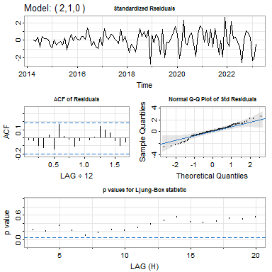

# 1 Problem1

## 1.1 Background

In today’s dynamic financial landscape, accurately predicting stock
prices is critical in the financial industry. The ability to predict
market movements not only facilitates informed decision-making but also
enables investors to take advantage of emerging opportunities or reduce
potential risks. In this context, our project focuses on Johnson &
Johnson (JNJ), a multinational company known for its role in the
healthcare industry.

## 1.2 Motiviation

The motivation behind the project stems from the inherent complexity and
uncertainty associated with financial markets, so investors often tangle
what method should be used so that the stock prices can be accurately
predicted.

The method of time series analysis and forecasting is advised here to
predict stock prices, which is an important tool in the financial
industry for predicting stock prices. Since stock prices exhibit various
patterns over time, such as trends and seasonality, time series analysis
allows us to discover these patterns and model them to make informed
predictions about future price movements. Moreover, time series models
may also capture and explain the volatility of stock prices, providing
insights into price uncertainties.

## 1.3 Problem Statement

The main objective of the project is to develop a robust predictive
model for JNJ’s share price in one year, i.e., 12 months.

# 2 Plan

The plan of the project is to determine the best-fitted time series
model by comparing the proposed models using different methods,
including regression, smoothing, and Box-Jenkins, and then use the
selected model to predict JNJ’s future share price.

# 3 Data

## 3.1 Data Collection and Integrity

The dataset used for this project is JNJ’s monthly historical stock
prices from January 1985 to March 2024. The dataset was directly
downloaded from *Yahoo! Finance* with the following URL: [Johnson &
Johnson (JNJ) historical price
data](https://ca.finance.yahoo.com/quote/JNJ/history?period1=1425686400&period2=1709769600&interval=1mo&filter=history&frequency=1mo&includeAdjustedClose=true),
which is a complete dataset during this time period and free of missing
values.

## 3.2 Data Description and Division

By importing the entire dataset of JNJ’s monthly historical stock prices
from January 1985 to March 2024 and showing the first five rows of the
data, it is clear to see the information provided for this stock,
including the date, open price, highest price, lowest price, close
price, adjusted close price, and volume of each month’s first day. We
also provide a plot of the entire dataset here. There is an exponential
trend during the whole period and a bump in 2021 because JNJ profited
from providing COVID-19 vaccines during the pandemic.

| Date       |     Open |     High |      Low |    Close | Adj.Close |    Volume |
|:-----------|---------:|---------:|---------:|---------:|----------:|----------:|
| 1985-01-01 | 2.242188 | 2.453125 | 2.195313 | 2.437500 |  0.975024 | 141102400 |
| 1985-02-01 | 2.390625 | 2.507813 | 2.312500 | 2.460938 |  0.984401 | 131019200 |
| 1985-03-01 | 2.437500 | 2.632813 | 2.421875 | 2.625000 |  1.058037 | 149992000 |
| 1985-04-01 | 2.609375 | 2.796875 | 2.523438 | 2.742188 |  1.105271 | 183592000 |
| 1985-05-01 | 2.726563 | 2.960938 | 2.679688 | 2.937500 |  1.183994 | 136675200 |

First Five Rows of JNJ Historical Stock Prices

However, this project will only focus on the ten-year (from April 2014
to March 2024) adjusted close stock prices (in USD) of JNJ because
recent years’ data can provide more informative information for
predicting stock prices and can make the variance more constant. Note
that the adjusted close price means the closing price after adjustments
for all applicable splits and dividend distributions, by definition from
*Yahoo! Finance*.

For modelling purposes, we divide the data into training data (from
April 2014 to March 2023) and testing data (from April 2023 to March
2024). All models are to be fitted using the training set, and the
testing set is only used to check the final model’s forecasting power.

Then, we create a time series object based on the ten-year monthly
adjusted close prices and give the time series plot of the data with
divisions of training and testing datasets.

The data shows an increasing trend and potential seasonality with
possible expanding variability. Therefore, the data is non-stationary.
There are no apparent outliers in the plot.

## 3.3 Possible Solutions

One of the possible solutions to make the data more stationary is doing
transformations. Since we observed a fanning-out pattern, we check the
stability of variance in the data by conducting a Fligner-Killeen Test
to see if transformations are needed, where the null hypothesis is the
homogeneity of variances.

    ## 
    ##  Fligner-Killeen test of homogeneity of variances
    ## 
    ## data:  JNJ.ts and seg
    ## Fligner-Killeen:med chi-squared = 16.225, df = 9, p-value = 0.06233

Since the *p*-value of the test is greater than *α* = 0.05, there is no
evidence against the null hypothesis at the 0.05 significance level; the
constant variance assumption is not violated. Therefore, there is no
need to do any transformations here.

# 4 Analysis

## 4.1 Regression Modelling

### 4.1.1 Model Proposal and Fitness Quality

We first propose the unregularized regression model with only the trend
component. By plotting the quadratic loss function versus the degree of
the polynomial and the scale-invariant loss function versus the degree
of the polynomial, we discover that both MSE and MSI values reach their
minimum values at *p* = 4.

Then, we propose the regression model with both the trend and
seasonality components. By plotting the quadratic loss function versus
the degree of the polynomial and the scale-invariant loss function
versus the degree of the polynomial, we discover that both MSE and MSI
values reach their minimum values at *p* = 4 as well. Therefore, adding
the seasonality does not help propose a new model.

| Regression                              |      MSE |       MSI |
|:----------------------------------------|---------:|----------:|
| Only consider the trend                 | 120.4273 | 0.0034556 |
| Consider both the trend and seasonality | 140.2979 | 0.0041335 |

In the end, we choose the unregularized regression model with only the
trend component and degree of polynomial equal to 4 since it has a
smaller MSE.

### 4.1.2 Model Diagnostics

For the next step, we check if the chosen model satisfies the error term
assumptions.

    ## 
    ##  Shapiro-Wilk normality test
    ## 
    ## data:  residuals(mod.regression)
    ## W = 0.98043, p-value = 0.1128

    ## 
    ##  Fligner-Killeen test of homogeneity of variances
    ## 
    ## data:  residuals(mod.regression) and segment
    ## Fligner-Killeen:med chi-squared = 20.584, df = 8, p-value = 0.008338

    ## 
    ##  Difference Sign Test
    ## 
    ## data:  residuals(mod.regression)
    ## statistic = 0.4977, n = 108, p-value = 0.6187
    ## alternative hypothesis: nonrandomness

    ## 
    ##  Runs Test
    ## 
    ## data:  residuals(mod.regression)
    ## statistic = -5.994, runs = 24, n1 = 54, n2 = 54, n = 108, p-value =
    ## 2.047e-09
    ## alternative hypothesis: nonrandomness

From the graphical model diagnostic, we find that there appears to be a
pattern in the plot of residuals versus fitted values. The plot of
residuals versus time also shows this pattern. We think it may not have
the constant mean but have the constant variance. For the qqplot, we can
see that all the points are within the blue region, then we can say that
it satisfies the normality assumption of residuals. For the ACF plot, we
can see that from lag1 to lag4, they all cross the line of 95%
confidence interval of 0, so we say it may not satisfy the assumption of
independence.

Looking at the formal test, according to the Shapiro-Wilk normality
test, we can see that the p-value is significant, and there is no
evidence against *H*0 (the input data has a normal
distribution). It satisfies the normality assumption. According to the
Fligner-Killeen test of homogeneity of variance, we can see that the
p-value is less than 0.05, which is strong evidence against
*H*0 (the data has constant variance). According to the
difference signs test, we cannot reject the *H*0 (the data is
random) due to the significant p-value. However, according to the Runs
test, we can see that the p-value is less than 0.05, which is strong
evidence against *H*0 (the data is random). Due to the many
fluctuations in the data, we believe that the conclusion of the Runs
test is more accurate. Thus, we don’t think the data is random.

Therefore, the inference of individual parameters and prediction
intervals based on the model is invalid.

### 4.1.3 Prediction Power

By looking at the prediction of test set based on the fitted training
set, we observe that the actual values are below the predicted values
though the real values still lie in the prediction interval. We need to
check the prediction power more precisely by calculating the APSE.

$$
APSE=MSE\_{pred.}=\frac{\sum\_{y\in test}(y-\hat y)^2}{n\_{test}}=120.5942
$$

## 4.2 Smoothing Methods

### 4.2.1 Model Selection

To fit a smoother model, we will apply all combinations of Holt-Winters
smoothing methods, including simple exponential smoothing, double
exponential smoothing, additive HW and multiplicative HW, to estimate
the patterns in the data while ignoring the noise.

After fitting all four smoother models, we selected the double
exponential smoothing model as the best since it has the smallest APSE
of 45.57445. The parameters are *α̂* = 0.8814822 and *β̂* = 0.002122442.

| simple exponential | double exponential | additive HW | multiplicative HW |
|-------------------:|-------------------:|------------:|------------------:|
|           61.92671 |           45.57445 |    62.05079 |          64.51194 |

    ## Holt-Winters exponential smoothing with trend and without seasonal component.
    ## 
    ## Call:
    ## HoltWinters(x = JNJ.train, gamma = FALSE)
    ## 
    ## Smoothing parameters:
    ##  alpha: 0.8814822
    ##  beta : 0.002122442
    ##  gamma: FALSE
    ## 
    ## Coefficients:
    ##          [,1]
    ## a 150.2403648
    ## b   0.2402865

### 4.2.2 Model Diagnostics

Now, we check whether the residuals are stationary for the selected
model. No apparent trend and seasonality can be identified in the plot
of residuals and the ACF. The residual variance increased from 2019 to
no more than 5% of the cross 95% confidence interval. However, the
pandemic has affected the residuals’ variance and has increased it a
bit. We can still say the model is almost stationary. This makes the
double exponential model an acceptable model for predicting Johnson’s
stock prices because, besides the prediction power, it also has decent
fitting power.

## 4.3 Box-Jenkins Modelling

### 4.3.1 Model Proposal

First of all, we plot the stock price training data and the ACF and PACF
plots of it. The time series plot has an increasing trend with a
potential seasonality, and the ACF shows a slow decay, indicating that
the original training data is non-stationary because of non-constant
mean.

**Case 1:** Although the ACF plot does not show seasonality, the time
series plot may show the periodicity, so we will still check it. We
first start with a seasonal differencing:
∇12*X**t* = (1−*B*12)*X**t*.

Assuming the ACF plot shows an exponential decay, then it has already
achieved stationarity. PACF cuts off after lag 2. At this point,
*p* = 2, *d* = 0, *q* = 0, *P* = 0, *D* = 1, *Q* = 0, *s* = 12, so we
can propose an *S**A**R**I**M**A*(2,0,0) × (0,1,0)12 model.

Assuming the ACF plot shows a slow decay, then it has not achieved
stationarity yet. We continue to do a regular differencing following the
seasonal differencing:
∇∇12*X**t* = (1−*B*)(1−*B*12)*X**t*.

Now, there is no slow decay in the ACF plot, so it achieves
stationarity. The squared differencing ACF plot shows that the constant
variance assumption is satisfied.

-   The ACF plot cuts off after lag *q* = 1 or *q* = 2.
-   The PACF plot either shows an exponential decay or cuts off after
    lag *p* = 1 or *p* = 2.
-   If we do not look at the seasonal lags, then *P* = 0 and *Q* = 0.
-   If we look at the seasonal lags, then the ACF plot cuts off after
    lag *Q* = 1, and the PACF plot cuts off after *P* = 1.

Therefore, we propose models:
$$
\begin{aligned}
&SARIMA(0,1,1)\times(0,1,0)\_{12},\\\\SARIMA(1,1,1)\times(0,1,0)\_{12},\\\\SARIMA(2,1,1)\times(0,1,0)\_{12},\\
&SARIMA(0,1,1)\times(0,1,1)\_{12},\\\\SARIMA(1,1,1)\times(0,1,1)\_{12},\\\\SARIMA(2,1,1)\times(0,1,1)\_{12}, \\
&SARIMA(0,1,1)\times(1,1,0)\_{12},\\\\SARIMA(1,1,1)\times(1,1,0)\_{12},\\\\SARIMA(2,1,1)\times(1,1,0)\_{12},\\
&SARIMA(0,1,1)\times(1,1,1)\_{12},\\\\SARIMA(1,1,1)\times(1,1,1)\_{12},\\\\SARIMA(2,1,1)\times(1,1,1)\_{12}, \\
&SARIMA(0,1,2)\times(0,1,0)\_{12},\\\\SARIMA(1,1,2)\times(0,1,0)\_{12},\\\\SARIMA(2,1,2)\times(0,1,0)\_{12},\\
&SARIMA(0,1,2)\times(0,1,1)\_{12},\\\\SARIMA(1,1,2)\times(0,1,1)\_{12},\\\\SARIMA(2,1,2)\times(0,1,1)\_{12},\\
&SARIMA(0,1,2)\times(1,1,0)\_{12},\\\\SARIMA(1,1,2)\times(1,1,0)\_{12},\\\\SARIMA(2,1,2)\times(1,1,0)\_{12},\\
&SARIMA(0,1,2)\times(1,1,1)\_{12},\\\\SARIMA(1,1,2)\times(1,1,1)\_{12},\\\\SARIMA(2,1,2)\times(1,1,1)\_{12}.\\
\end{aligned}
$$

**Case 2:** Let us also try starting with a regular differencing:
∇*X**t* = (1−*B*)*X**t*.

It reaches stationarity at this point. The squared differencing ACF plot
shows that the constant variance assumption is satisfied. We can propose
models by only 1 time regular differencing.

-   The ACF plot either shows a damped sine wave or cuts off after lag 1
    or 2.
-   The PACF plot either shows an exponential decay or cuts off after
    lag 1 or 2.

Therefore, we propose models:
$$
\begin{aligned}
&ARIMA(0,1,0), \\\\ARIMA(0,1,1), \\\\ARIMA(0,1,2), \\
&ARIMA(1,1,0), \\\\ARIMA(1,1,1), \\\\ARIMA(1,1,2), \\
&ARIMA(2,1,0), \\\\ARIMA(2,1,1), \\\\ARIMA(2,1,2).
\end{aligned}
$$

### 4.3.2 Model Diagnostics

In Box-Jenkins Methodology, we check the assumption of
*e**r**r**o* ∼ *W**N*(0,*σ*2). That is, we check the
assumptions on residuals: 1) constant variance, 2) uncorrelated at each
lag, 3) normality, and 4) constant zero mean.

Fitting all the models by `sarima` function in R, we found that
*S**A**R**I**M**A*(2,1,2) × (0,1,1)12,
*A**R**I**M**A*(0,1,2), *A**R**I**M**A*(2,1,0), and
*A**R**I**M**A*(2,1,2) passed the residual diagnostics, and others did
not pass the residual diagnostics.

Removing the unqualified models, we plot the residual diagnostics of
qualified models.

### 4.3.3 Model Selection by Fit Quality and Prediction Power

By checking Akaike’s Information Criterion (AIC), Akaike’s Information
Criterion correlated (AICc), and Bayesian Information Criterion (BIC) of
the above models that have passed the residual diagnostics, ARIMA(0,1,2)
has the smallest BIC value, and ARIMA(2,1,2) has the smallest AIC and
AICc values. Overall, there is very little difference between the fit of
the models, so we can look at the APSE of all the four models.
ARIMA(2,1,0) has the smallest APSE value.

| Models                      |      AIC |     AICc |      BIC |      APSE |
|:----------------------------|---------:|---------:|---------:|----------:|
| SARIMA(2,1,2)×(0,1,1)\[12\] | 6.596083 | 6.603179 | 6.757380 | 117.58989 |
| ARIMA(0,1,2)                | 6.263767 | 6.265944 | 6.363686 |  62.46785 |
| ARIMA(2,1,0)                | 6.297085 | 6.299262 | 6.397004 |  29.37942 |
| ARIMA(2,1,2)                | 6.237146 | 6.242698 | 6.387024 | 174.16904 |

By plotting the forecasting for the test set, we observe that
ARIMA(2,1,0) has the best prediction for the test set since the red line
is approximately in the middle of the fluctuating blue line.

We will choose ARIMA(2,1,0) for our Box-Jenkins part as it has the
greatest prediction power, and our goal is to forecast stock prices.

# 5 Conclusion

## 5.1 Statistical Conclusions

To summarize,

-   the model selected in *4.1 regression modelling* is the 4th-degree
    unregularized regression model with poor assumption satisfactions
    and an APSE of 120.5942,
-   the model selected in *4.2 smoothing methods* is the double
    exponential smoothing model with an APSE of 45.57, and
-   the model selected in *4.3 Box-Jenkins Modelling* is ARIMA(2,1,0)
    with an APSE of 29.38.

Therefore, ARIMA(2,1,0) also has the minimum APSE among all the model
selected using three different time series methods, which is our final
model. We refit the final model to the whole data set and predict JNJ’s
stock price in 12 months.

## 5.2 General Conclusion

By analyzing the stock price of JNJ over the last ten years, several
conclusions can be drawn. Firstly, we can see that the stock price has
shown an increasing trend in the past 10 years. It does not exhibit a
seasonal pattern, as none of the models we selected included
seasonality. Upon analyzing the graph of the stock prices, it is evident
that, due to the COVID-19 pandemic, the variance of the stock price
increased slightly from 2021 to 2023. However, the variance is not
significant enough to dramatically change the pattern of the data, so
our prediction remains reliable. After applying the model with the
strongest predictive power to make projections, we can conclude that in
the next year, the stock price of JNJ is expected to rise to from $159
to around $167 USD.
